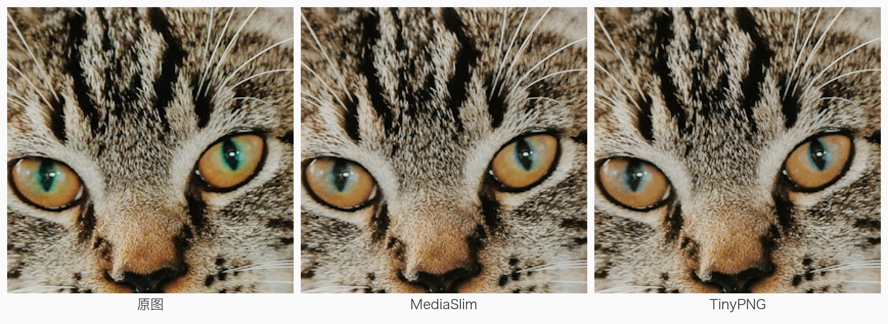
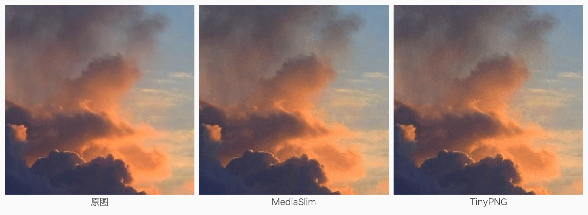

# MediaSlim vs TinyPNG: Image Compression Comparison

[简体中文](comparison-vs-tinypng.zh-CN.md) · **English**

> Measurement dates: JPEG corpus mid-July 2026, PNG corpus 2026-07-23.
> TinyPNG is a continuously evolving cloud service; this report compares a
> **same-day snapshot**. SHA-256 hashes of every TinyPNG output are archived —
> if your re-test differs from these numbers, that alone does not mean either
> side's data is wrong.

## TL;DR

| Dimension | MediaSlim | TinyPNG |
|---|---|---|
| JPEG quality floor | **Every image guaranteed SSIMULACRA2 ≥ 72** (text/UI ≥ 76) | Measured worst 68.6, with visibly degraded cases |
| JPEG size (same quality floor, public corpus) | **15% smaller** | — |
| PNG quality floor (79 images) | SSIM P05 **0.9739**, banding P95 **1.48** | 0.9616 / 2.26 |
| PNG size (comparable samples) | On par (+1.9%), paired quality median **slightly ahead** | — |
| Compression coverage | **Delivers a result for every image** | Returned 9 of 79 images untouched |
| Privacy | **Fully local, nothing uploaded** | Images processed in the cloud |

## 1. Methodology

**Corpora.** Two sets with different purposes:

- Public benchmark (JPEG, 30 images): encoded once from lossless Kodak / CLIC /
  DIV2K sources. Lossless sources avoid the systematic bias where
  already-compressed inputs flatter fixed-quality encoders;
- Real-world set (79 PNG + 64 JPEG): app screenshots, mixed text/photo pages,
  faces, pet fur, low light, high texture, flat skies, line art. Chosen to
  mirror realistic usage — not to favor either side.

**Metrics.** Primary metric is
[SSIMULACRA2](https://github.com/cloudinary/ssimulacra2) ("S2"), one of the
public metrics best correlated with human opinion scores; PSNR-Y / SSIM-Y are
cross-checked to guard against single-metric bias. Beyond means we focus on the
**worst 5th percentile (P05)** — users remember the worst image, not the average.

**Obtaining TinyPNG results.** Uploaded/downloaded via the web UI (no tunable
parameters), filenames matched 1:1 with sources, output SHA-256 archived.
TinyPNG exposes no quality parameter, so this compares each product's default
quality–size operating point, not identical settings.

**Subjective validation.** Metric conclusions were checked by three rounds of
human blind testing (flicker test: rapidly toggling between the original and the compressed image).
Round three added quality controls: 3% catch trials to measure the
false-positive floor, and every trial repeated twice (79% consistency). Round
three overturned some earlier conclusions — only findings that survived the
controls are kept here.

## 2. JPEG

### 2.1 Mechanism: fixed quality vs closed-loop search

TinyPNG picks a fixed quality per image (measured ~q66–q96, median ~q83).
MediaSlim runs a closed loop per image: encode → S2 score → binary-search the
lowest quality that still clears the perceptual floor. This wins on both ends:

- Easy images don't waste bytes: **15% smaller** than TinyPNG at the same
  quality floor on the public corpus (7.29 MB vs ~8.6 MB);
- Hard images don't fall through the floor: a fixed setting measurably drops to
  58.7 on hard images (clearly visible degradation); the closed loop holds 72.1.

**Honest note**: at equal quality, our pure-encoder efficiency edge is only
~5%. The gains above come from per-image operating-point selection — that is
precisely the value of the closed loop, and a boundary we state explicitly.

### 2.2 Quality consistency (public corpus, S2)

| | Worst | Median | Spread (max − min) |
|---|---|---|---|
| MediaSlim (closed loop ≥ 72) | **72.1** | 72.5 | **2.4** |
| TinyPNG | 68.6 | 75.7 | ≥ 7 |

TinyPNG's mean is higher — it spends 15% more bytes on average — but its floor
is lower and its variance larger.

### 2.3 Real-world images

| Corpus | MediaSlim | TinyPNG | Delta |
|---|---|---|---|
| Real photos, 48 images (33.4 MB source) | 8.6 MB (−74%) | 20.4 MB (−39%) | **−58%** |
| Text/UI, 16 images | 2.29 MB | 2.25 MB | +1.7% (par) |

The huge photo-row gap needs context: real-world images have usually been
compressed once already, and TinyPNG barely re-compresses such inputs, while
the closed loop still re-optimizes to the perceptual floor. This is a common
real-world scenario, but it is **not** an encoder-efficiency gap — read it
together with the ~5% note in 2.1.

### 2.4 Subjective blind test

Under the flicker test, both products are **comparably detectable** on photos, and
the detectable samples concentrate in the same categories (faces, mixed
text/photo pages) — a shared boundary of JPEG at this size point, not a
differentiator. Neither is fully transparent; transparency would cost another
14–23% in bytes.

## 3. PNG (79 images, 2026-07-23)

### 3.1 Totals, and "declining to compress"

| | Total bytes | Saved | S2 median / P05 | SSIM median / P05 | Banding median / P95 |
|---|---:|---:|---|---|---|
| MediaSlim | 55.8 MB | **66.4%** | 78.4 / **67.0** | **0.9946 / 0.9739** | **0.52 / 1.48** |
| TinyPNG | 100.4 MB | 39.5% | **79.7** / 66.0 | 0.9943 / 0.9616 | 0.56 / 2.26 |

The 44.5 MB headline gap must be decomposed: **TinyPNG returned 9 of 79 images
untouched** (0% saved — its own quality safeguard), while we compressed the
same images by 58–90% (S2 67–85). These are two reasonable but different
product decisions:

- **Excluding those 9, sizes are on par (we are +1.9%) with a paired S2 median
  delta of +0.81** — i.e. slightly better quality at equal size;
- The remaining difference: MediaSlim delivers a result for every image;
  TinyPNG declines some.

### 3.2 By content type

| Type | n | Size delta (ours vs TinyPNG) | Per-image S2 wins |
|---|---:|---:|---:|
| Pet fur | 6 | +0.3% | **6/6** |
| Flat sky | 4 | −5.8% | **4/4** |
| High texture | 6 | +3.4% | 5/6 |
| Mixed text/photo | 6 | +6.3% | 5/6 |
| Low light | 6 | +6.3% | 4/6 |
| Faces | 6 | **−28%** | 3/6 |
| Text/UI screenshots | 6 | +0.1% | **0/6** |
| Line art / icons etc. | 39 | −60.3% (incl. 9 declined) | 16/39 |

Photos are our strength; **text/UI screenshots are our clear weak spot**
(size par but S2 behind on all six, median 87.1 vs 88.0). Overall, 13 of 79
images are strictly dominated by TinyPNG (smaller and better) — listed as is.

### 3.3 Visual comparison (200% crops)

Crop locations were selected by per-block error data (the regions where the two
outputs differ most from the source) — not hand-picked. The three examples
cover both outcomes: two where we lead, one where TinyPNG leads.

**① Pet fur (size par: 746 KB vs 742 KB)** — look at the pupils: TinyPNG's
iris shows clear blue dither speckle; MediaSlim stays closer to the original
(S2 80.4 vs 77.3).

**② Flat sky gradient (we are smaller: 338 KB vs 348 KB)** — PNG8 must dither
gradients, so both show grain; TinyPNG's grain is coarser with double the
banding score (0.92 vs 0.44; S2 72.1 vs 75.4).

**③ Text/UI screenshot (TinyPNG smaller and better: 287 KB vs 330 KB)** —
look at the red icon's rim: MediaSlim shows visible dither fringing; TinyPNG is
cleaner (S2 86.0 vs 85.3). This is the weak spot from 3.2, shown as is.

## 4. Product differences beyond the algorithm

| | MediaSlim | TinyPNG |
|---|---|---|
| Data never leaves your Mac | ✅ fully local | ❌ cloud upload |
| Works offline / no network cost | ✅ | ❌ |
| Input limits | 60 MP / 20000 px | Web version has size/count limits |
| Batch | Concurrent batch with memory-aware scheduling | Web: one by one; API: metered |
| Memory behavior | ≤ ~800 MB peak for a 59 MP image, settles in 3 s | n/a |

## 5. Boundaries and limitations (honest statement)

- Text/UI PNG screenshots trail TinyPNG slightly (see 3.2) — our clearest
  improvement target;
- Face JPEGs are flicker-test detectable for both products at realistic sizes;
  full transparency costs extra bytes and is a product trade-off, not a
  technical gap;
- Half-photo/half-UI pages cannot be reliably classified by cheap statistics;
  such pages rely on a conservative per-class floor;
- At equal quality our pure-encoder edge is only ~5%; the main value is the
  per-image closed loop and the guaranteed floor;
- Blind testing was single-rater across multiple controlled rounds; raw
  quantitative results are not published and support qualitative claims only;
- TinyPNG evolves; this report reflects behavior on the measurement dates only.

## 6. Data provenance and archive

- **Per-image PNG raw data**:
  [docs/data/png-comparison-2026-07-23.csv](data/png-comparison-2026-07-23.csv)
  — size, S2, PSNR-Y, SSIM-Y, alpha error, banding scores and more for all
  79 images × both candidates, with SHA-256 of sources and outputs. Every PNG
  number in this report can be recomputed from it;
- Dataset SHA-256:
  `4098be152daa2d0c51a26e23dd0b3bec403cf5fdc40d09979c7df5ed16303adb`;
- TinyPNG outputs are a July 2026 web-UI snapshot; content hashes in the CSV;
- The public JPEG corpora (Kodak / CLIC / DIV2K) are freely downloadable and
  can be re-scored with any SSIMULACRA2 implementation;
- The measurement toolchain lives in a closed-source development repository and
  is not part of this repo; the business corpus cannot be published for
  licensing reasons.
